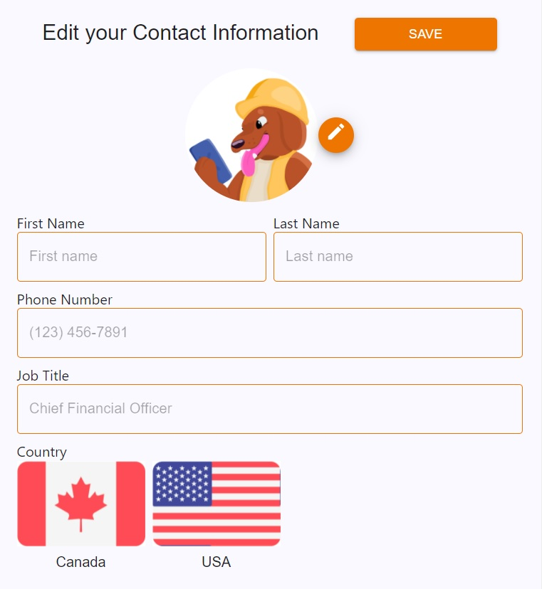
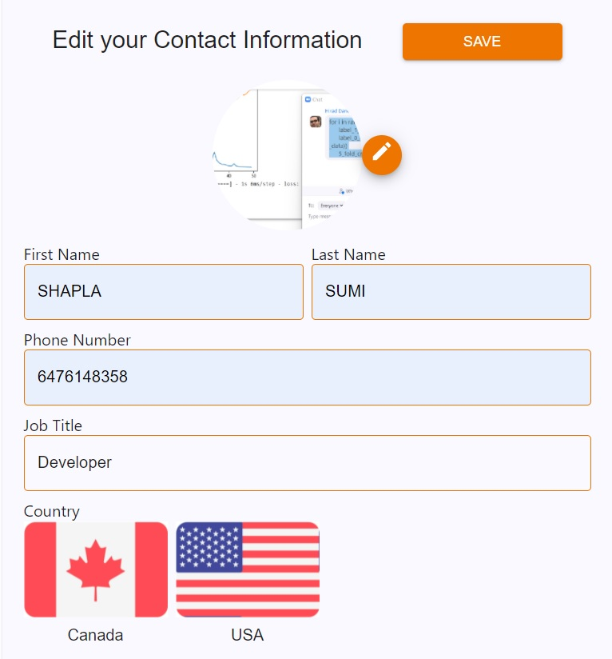
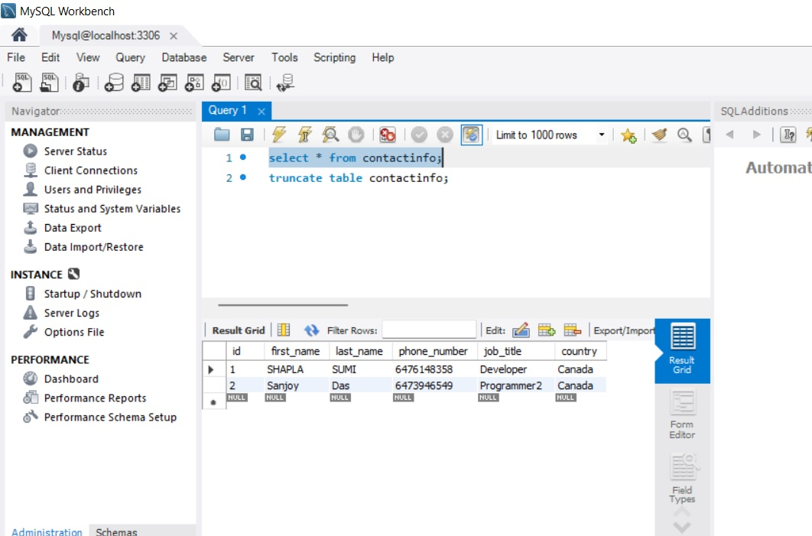

## Creating a Starter React Project

- $ npx create-react-app react-flask-app
- $ cd react-flask-app

## Creating a Flask API Backend

- $ mkdir api
- $ cd api

## Create a virtual environment called "venv" for Windows OS using git bash

- $ python -m venv venv
- $ venv/Scripts/activate

## Add custom commands inside scripts of package.json file

- "start-api": "cd api && flask run --no-debugger"

- $ npm run start-api

## Front End Design

## After insert contact info into the Front End Design

## After insert contact info into the MySQL Database

## Dependencies

### Front side dependencies

- @emotion/react
- @emotion/styled
- @material-ui/core
- @mui/icons-material
- @mui/material
- @mui/styled-engine
- @testing-library/jest-dom
- @testing-library/react
- @testing-library/user-event
- axios
- react
- react-dom
- react-scripts
- web-vitals

### Sever side dependencies

- cors
- dotenv
- Flask
- flask_sqlalchemy
- flask_marshmallow
- flask_cors

## Getting Started

- Clone git : git clone https://github.com/sanjoy-kumar/flask-mysql-react-js.git
- Install dependencies: npm i
- Run the server or back end: npm run start-api or flask run
- Run the client or front end: npm start (note: nodemon is not used, so you should have to restart your server)
- Visit http://localhost:5000/ for server
- Visit http://localhost:3000/ for client

